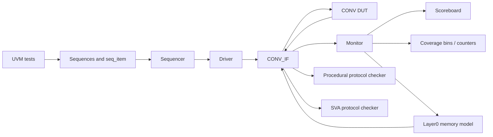

# CONV UVM Verification Project

A reusable UVM 1.2 environment for a two-layer convolution accelerator. The project verifies real DUT data flow with supplied `.dat` vectors, checks protocol and liveness rules, and proves checker effectiveness through expected-fail RTL fault injection.

## Verification Scope

The environment currently proves:

- Configurable sequence-to-driver stimulus through `conv_seq_item`.
- Virtual-interface delivery through `uvm_config_db`.
- Image input driven from `cnn_sti.dat`.
- Layer0 memory feedback through `conv_l0_mem_model`.
- Full Layer0 golden comparison: 4096 writes.
- Full Layer1 golden comparison: 1024 writes.
- Layer0 and Layer1 address completeness.
- Duplicate, missing, illegal, and out-of-range address detection.
- Reset protocol and reset-in-flight recovery.
- Ready/busy protocol and bounded ready-to-busy liveness.
- ModelSim-compatible SVA checker hooks for selected protocol faults.
- Transaction coverage with covergroup-ready bins and ModelSim counter fallback.
- Generated dataset regression for zero, high-value, and border-sensitive inputs.
- Eight expected-fail DUT fault scenarios using the same checker stack.

## Architecture



`CONV_IF` is instantiated in `top.sv`, outside the agent. The agent owns the sequencer, driver, and monitor. The monitor publishes observed ready, read, and write activity to the scoreboard, coverage subscriber, and Layer0 memory model.

### Data Flow

1. A test configures sequence length, dataset root, `.dat` paths, drive duration, expected counts, and checker modes.
2. `conv_basic_sequence` transfers those settings through `conv_seq_item`.
3. `conv_driver` applies reset/ready and drives `idata` using the DUT's registered `iaddr`.
4. The DUT writes Layer0 data through `cwr/caddr_wr/cdata_wr`.
5. `conv_l0_mem_model` stores Layer0 writes and returns `cdata_rd` for pooling reads.
6. `conv_monitor` converts bus activity into analysis transactions.
7. `conv_scoreboard` checks golden data, counts, and address maps.
8. `conv_assertions.sv` and `conv_sva.sv` check protocol, reset, range, and liveness rules.

## One-Command Final Regression

Run the complete interview regression:

```powershell
powershell -ExecutionPolicy Bypass -File .\run_final_regression.ps1
```

The final runner executes 19 ordered gates:

- Default smoke regression.
- Layer0 and Layer1 golden comparisons.
- Zero dataset golden comparison.
- High-value and border-sensitive dataset path checks.
- Layer0 and Layer1 address maps.
- Reset-in-flight recovery.
- Reset protocol and ready-to-busy liveness baselines.
- Eight expected-fail DUT fault scenarios.

Each failed case is retried once by default to isolate intermittent simulator startup crashes:

```powershell
powershell -ExecutionPolicy Bypass -File .\run_final_regression.ps1 -MaxAttempts 2
```

Preview the matrix without running ModelSim:

```powershell
powershell -ExecutionPolicy Bypass -File .\run_final_regression.ps1 -ListOnly
```

The final matrix is written to:

```text
reports/final_<timestamp>/final_regression_summary.md
```

## Individual Smoke Cases

Use `run_smoke.ps1` for focused debugging:

```powershell
powershell -ExecutionPolicy Bypass -File .\run_smoke.ps1 -Test l1_expected
powershell -ExecutionPolicy Bypass -File .\run_smoke.ps1 -Test reset_inflight
powershell -ExecutionPolicy Bypass -File .\run_smoke.ps1 -Test fault_duplicate_l1
powershell -ExecutionPolicy Bypass -File .\run_smoke.ps1 -Test zero_dataset
powershell -ExecutionPolicy Bypass -File .\run_smoke.ps1 -Test high_value_dataset
powershell -ExecutionPolicy Bypass -File .\run_smoke.ps1 -Test border_dataset
```

### Baseline and Functional Matrix

| Test key | Proof |
|---|---|
| `all` | Base UVM plumbing, scenarios, data drive, memory feedback, protocol positive/negative paths |
| `l0_expected` | Layer0 golden compare, 4096/4096 |
| `l1_expected` | Layer1 golden compare, 1024/1024 |
| `zero_dataset` | Generated zero image, generated L0/L1 golden, 4096/4096 and 1024/1024 |
| `high_value_dataset` | Generated high positive image through full Layer1 address-map path |
| `border_dataset` | Generated high-value border frame through full Layer1 address-map path |
| `l0_addr_map` | Layer0 unique addresses 0-4095 |
| `l1_addr_map` | Layer1 unique addresses 0-1023 |
| `reset_inflight` | Reset during busy, restart, and post-reset Layer1 golden compare |
| `reset_protocol` | `busy/cwr/crd` remain low during reset |
| `ready_busy_liveness` | Busy responds within one cycle for the normal DUT |

### Expected-Fail Fault Matrix

An expected-fail case passes only when its required checker signature appears with the exact expected UVM error count and zero UVM fatals.

| Test key | RTL fault | Expected proof |
|---|---|---|
| `fault_l0_data` | `FI_BUG1_L0_DATA` | Layer0 mismatch at address 123 |
| `fault_l1_data` | `FI_BUG2_L1_DATA` | Layer1 mismatch at address 17 |
| `fault_illegal_csel` | `FI_ASSERT_ILLEGAL_CSEL` | `[CWR_ILLEGAL_CSEL]` and `[SVA_CWR_ILLEGAL_CSEL]`, `csel=010` |
| `fault_missing_l0` | `FI_BUG3_MISSING_L0` | `[L0_ADDR_MISSING]`, address 123 |
| `fault_duplicate_l1` | `FI_BUG4_L1_DUP_ADDR` | Duplicate address 0 and missing address 1 |
| `fault_l1_addr_oob` | `FI_ASSERT_L1_ADDR_OOB` | `[L1_ADDR_OOB]` and `[SVA_L1_ADDR_OOB]`, address 1024 |
| `fault_reset_protocol` | `FI_ASSERT_RESET_PROTOCOL` | `[RESET_CWR]` and `[SVA_RESET_CWR]` once per reset episode |
| `fault_ready_busy_timeout` | `FI_ASSERT_READY_BUSY_TIMEOUT` | `[READY_BUSY_TIMEOUT]` and `[SVA_READY_BUSY_TIMEOUT]` after eight cycles |

Each expected-fail test also requires a `fault_class=<name> id=<id> covered` coverage anchor.

## Key Files

| File | Responsibility |
|---|---|
| `top.sv` | Clock, interface, named DUT connections, checker wiring, `run_test()` |
| `conv_pkg.sv` | UVM class compilation order |
| `conv_driver.sv` | Reset/ready control and image-data driving |
| `conv_monitor.sv` | Ready, read, and write observation |
| `conv_l0_mem_model.sv` | Layer0 storage and read feedback |
| `conv_scoreboard.sv` | Golden compare, counts, missing/duplicate address checks |
| `conv_assertions.sv` | Procedural protocol, reset, range, and liveness checker |
| `conv_sva.sv` | ModelSim-compatible SV assertion hooks for protocol fault evidence |
| `conv_dataset_golden_smoke_test.sv` | Dataset-root L0/L1 golden regression |
| `conv_coverage.sv` | Covergroup-ready transaction and fault-class coverage counters |
| `CONV_buggy.v` | Compile-time RTL fault-injection variants |
| `run_smoke.ps1` | Single-case compiler and gate runner |
| `run_final_regression.ps1` | Final 16-case regression orchestrator |

## Environment

The verified local environment is:

- Windows PowerShell.
- Intel FPGA Lite 18.1.
- ModelSim Intel FPGA Edition 10.5b.
- UVM 1.2 with `UVM_NO_DPI`.

`run_smoke.ps1` currently references:

```text
C:\intelFPGA_lite\18.1\modelsim_ase\verilog_src\uvm-1.2\src
```

Update `$UvmSrc` if ModelSim is installed elsewhere.

## Known Limitations

- ModelSim 10.5b intermittently exits with `SIGSEGV` while loading a compiled design. This occurs before UVM execution and is distinct from a checker failure. The final runner retries a failed case once and preserves each console log.
- ModelSim ASE 10.5b does not run full concurrent SVA or covergroups without Questa features. `conv_sva.sv` therefore uses immediate SV assertions, and `conv_coverage.sv` keeps covergroups behind `CONV_ENABLE_COVERGROUPS` with a counter fallback for local smoke runs.
- Coverage is transaction/fault-class coverage rather than internal FSM and cross-coverage closure.
- Golden validation uses the supplied fixed image and the generated zero dataset. High-value and border-sensitive datasets currently prove path/count/address behavior, not independent numerical golden closure.
- Simulator paths are Windows and ModelSim specific.

## Interview Positioning

The project demonstrates one shared UVM environment across three scenario families:

1. Clean directed and golden-data validation.
2. Reset and liveness recovery scenarios.
3. Expected-fail RTL fault injection with exact checker signatures.

The important result is not merely that the DUT passes. The same environment also proves that data, address, protocol, reset, range, and timeout defects are detected at the intended verification layer.

## Interview Materials

- [Architecture and responsibility guide](docs/interview_architecture.md)
- [Complete verification test matrix](docs/test_matrix.md)
- [Reset, duplicate-address, and liveness debug stories](docs/debug_stories.md)
- [Final 19/19 verification record](docs/final_verification.md)
