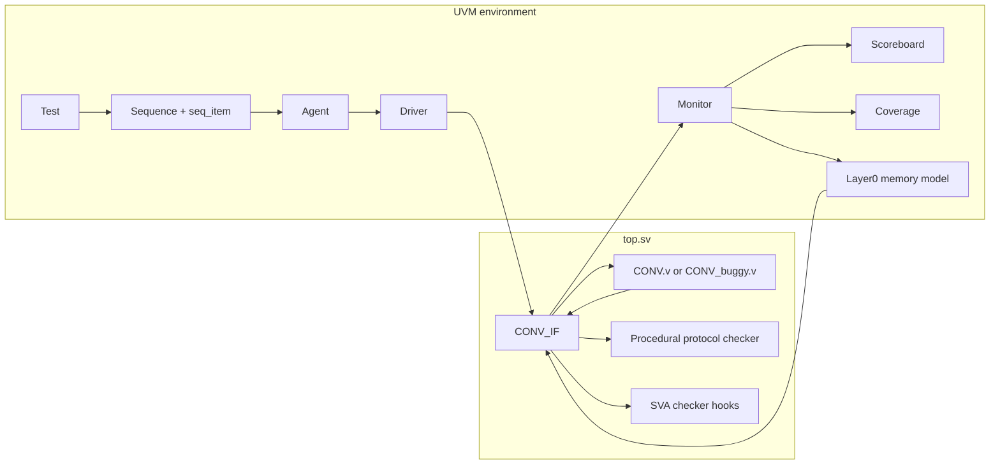

# Interview Architecture Guide

## Project in One Sentence

This project uses one reusable UVM environment to validate a two-layer convolution accelerator across clean golden-data runs, reset/liveness scenarios, and expected-fail RTL fault injection.

## Architecture



`CONV_IF` belongs in `top.sv`, not inside the agent. It represents the physical DUT boundary and is distributed to UVM components through `uvm_config_db`.

## Responsibility Boundaries

| Layer | Files | Responsibility |
|---|---|---|
| Scenario control | `conv_test.sv`, specialized tests | Select stimulus, duration, expected counts, checker modes, reset/fault scenarios |
| Transaction intent | `conv_seq_item.sv`, sequences | Carry timing, image, drive, and reset controls |
| Active agent | `conv_sequencer.sv`, `conv_driver.sv` | Sequence arbitration and pin-level stimulus |
| Observation | `conv_monitor.sv` | Convert ready/read/write activity into analysis transactions |
| External memory behavior | `conv_l0_mem_model.sv` | Store Layer0 writes and feed pooling reads back to the DUT |
| Data and structural checking | `conv_scoreboard.sv` | Golden compare, count checks, address completeness, duplicate/missing detection |
| Protocol and liveness checking | `conv_assertions.sv`, `conv_sva.sv` | Reset rules, csel legality, address range, ready/busy exclusion, bounded response |
| Reach tracking | `conv_coverage.sv` | Transaction-level ready/read/write/reset/address buckets and fault-class bins |
| Automation | `run_smoke.ps1`, `run_final_regression.ps1` | Compile selection, expected signatures, exact error gates, final matrix |

## Data Path

1. The test selects either the default dataset or a generated dataset root.
2. The driver loads `cnn_sti.dat`.
3. At each stable address boundary, it drives `idata` from the DUT's `iaddr`.
4. Layer0 writes are observed and stored by the memory model.
5. Pooling reads are served through `cdata_rd`.
6. The monitor publishes write/read transactions.
7. The scoreboard compares Layer0 and Layer1 writes against supplied or generated golden files.
8. Address bitmaps prove completeness and detect duplicate/missing locations.

## Control and Protocol Path

- Reset and ready timing are transaction-controlled.
- Reset-in-flight asserts reset while the DUT is busy, then restarts the same environment.
- The procedural checker samples stable signals at `negedge clk`.
- `conv_sva.sv` mirrors selected protocol faults with ModelSim-compatible SV assertion IDs.
- Reset violations are reported once per reset episode.
- Ready-to-busy liveness starts on a ready request and requires busy within eight cycles.

## Fault-Injection Architecture

The test scenario and DUT implementation are selected independently:

```text
scenario selection: +UVM_TESTNAME=<test class>
DUT selection:       CONV.v or CONV_buggy.v
fault selection:     +define+FI_...
```

`run_smoke.ps1` compiles `CONV.v` for clean cases. A fault case compiles `CONV_buggy.v` with exactly one fault macro. The same monitor, scoreboard, memory model, and protocol checker validate both versions.

This separation is important: a fault test passes only when the intended checker signature appears with the exact expected UVM error count and zero UVM fatals.

Fault-class coverage is also selected from the script. Expected-fail tests pass only when the intended checker evidence and the intended `fault_class=<name> id=<id> covered` anchor both appear.

## Dataset Architecture

`run_smoke.ps1` supports `-DatasetRoot` and passes it to UVM as `+CONV_DATASET_ROOT`. The checked-in datasets remain untouched. Generated datasets are created under the local `reports/` tree:

| Dataset test | Data source | Proof |
|---|---|---|
| `zero_dataset` | all-zero image plus generated `01310` L0/L1 expected data | Full L0/L1 golden compare |
| `high_value_dataset` | all-`7FFFF` image | Full Layer1 address-map path |
| `border_dataset` | high border frame, zero interior | Full Layer1 address-map path |

## Strong Interview Claims

- The environment checks real DUT output, not only UVM component connectivity.
- Layer0 and Layer1 are fully compared against golden datasets.
- Total transaction count is not treated as address completeness.
- Reset recovery is followed by a complete Layer1 golden compare.
- Protocol faults and data faults are checked by different verification layers.
- Liveness is bounded, so a stalled DUT produces a deterministic failure instead of a hanging simulation.
- Dataset expansion is honest about proof level: zero is golden, high/border are path and address-map stress.

## Deliberate Limitations

- ModelSim ASE limits concurrent SVA and covergroup runtime support; the local regression uses immediate SV assertion hooks and counter fallback while preserving covergroup-ready code behind `CONV_ENABLE_COVERGROUPS`.
- Coverage is transaction and fault-class coverage rather than internal FSM/cross coverage.
- Golden closure currently uses the supplied image dataset and generated zero dataset.
- The scripts target Windows ModelSim ASE and a configured UVM 1.2 path.
